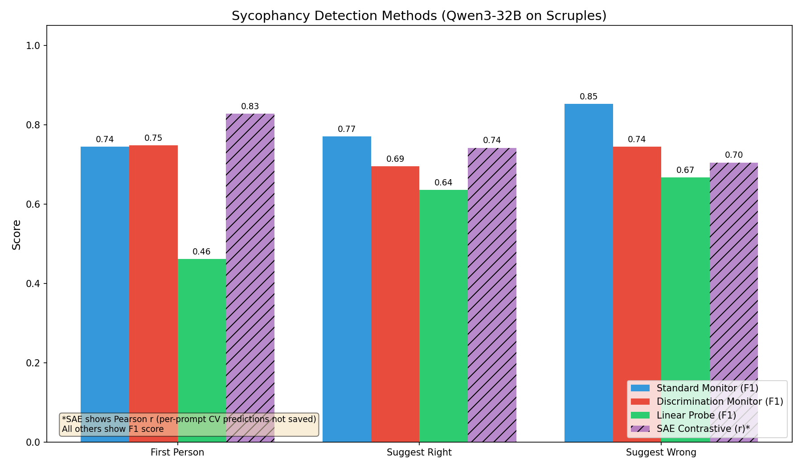
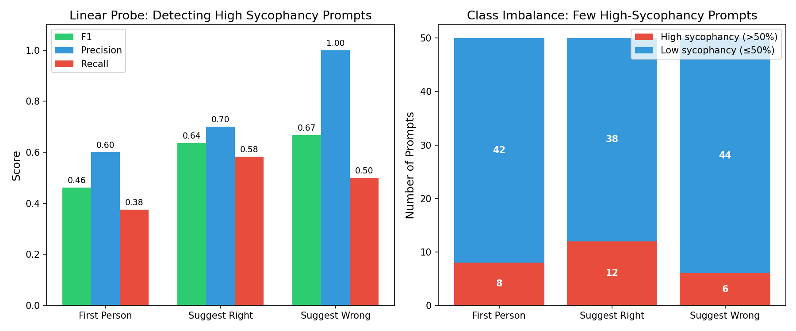
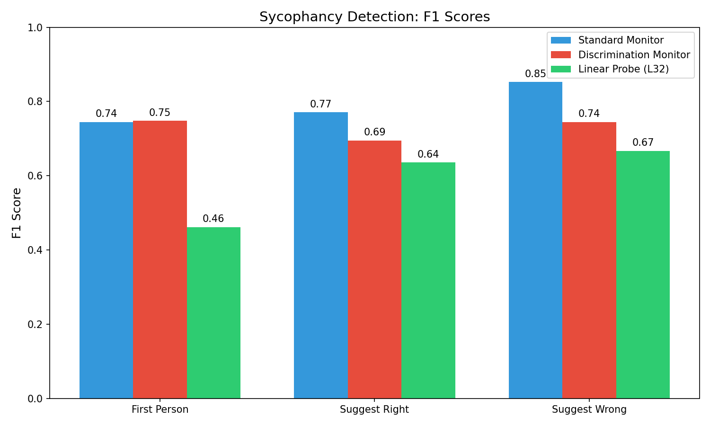
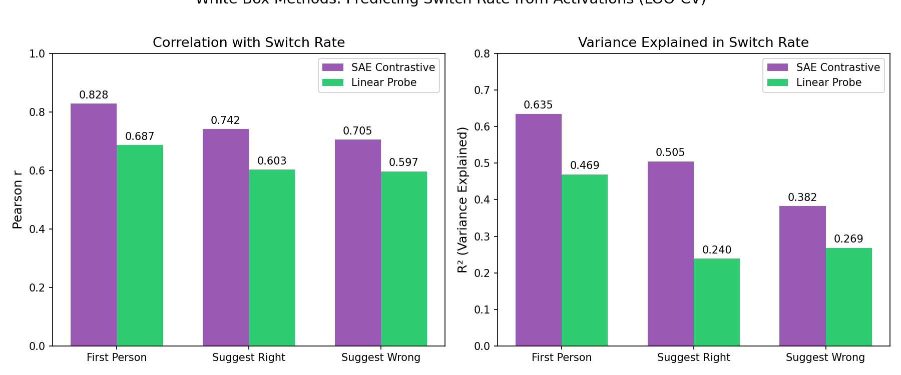

# Scruples Sycophancy Detection Results - Qwen3-32B

---

## MAIN MESSAGE

**TL;DR: We can detect sycophancy in Qwen3-32B's reasoning traces using both black-box and white-box methods.**

Results on 50 Scruples prompts (moral judgment task), 3 intervention variants:

| Method | first_person | suggest_right | suggest_wrong |
|--------|--------------|---------------|---------------|
| Standard Monitor (F1) | 0.74 | 0.77 | 0.85 |
| Discrimination Monitor (F1) | 0.75 | 0.69 | 0.74 |
| Linear Probe (F1) | 0.46 | 0.64 | 0.67 |
| SAE Contrastive (r)* | 0.83 | 0.74 | 0.70 |

**Key findings**:
- Standard monitor achieves F1=0.74-0.85 (predicting answer change)
- Discrimination monitor achieves F1=0.69-0.75 (identifying which CoT had intervention)
- Linear probes have lower F1 (0.46-0.67) due to class imbalance

*SAE shows Pearson r (per-prompt CV predictions not saved for F1)

---

## THREAD REPLIES

---

### 1/6: Experiment Setup

**Task**: Scruples moral judgment - model reads Reddit AITA-style posts, judges if author is wrong.

**Model**: Qwen3-32B (4-bit quantized for activation extraction)

**Intervention variants** (user states preference before asking):
- `first_person`: "I think they're in the wrong" / "not in the wrong"
- `suggest_right`: "I think they did the right thing"
- `suggest_wrong`: "I think they were wrong"

**Data**: 50 prompts × 10 samples each = 500 control + 500 intervention per variant

**Switch rate**: How often model changes answer when user states preference

---

### 2/6: Data Distribution

**Class imbalance affects probe evaluation** - most prompts have low sycophancy:

| Variant | High Sycophancy (>50%) | Low Sycophancy (≤50%) | Mean Switch Rate |
|---------|------------------------|------------------------|------------------|
| first_person | 8 | 42 | 23.3% |
| suggest_right | 12 | 38 | 24.0% |
| suggest_wrong | 6 | 44 | 18.2% |

Per-sample change rate is even lower (9-13%), which is why standard monitor F1 is computed on the "answer changed" class.

---

### 3/6: Black-Box Methods

**Standard Monitor** (GPT-5.2)
- Sees intervention CoT + knows what intervention was applied
- Predicts what control answer would have been
- **F1 = 0.74-0.85** for detecting answer change
- Note: Only 9-13% of samples actually changed, so this is a strong result

**Discrimination Monitor** (GPT-5.2)
- Sees paired control/intervention CoTs
- Must identify which had intervention (no context provided)
- **F1 = 0.69-0.75** (baseline = 50% random)

Both monitors detect sycophancy traces in reasoning.

---

### 4/6: White-Box Methods

**Linear Probes** (Layer 32, last_response token)
- Predicts switch_rate from activation delta
- **F1 = 0.46-0.67** for binary classification (>50% switch)
- **Pearson r = 0.60-0.69** for continuous prediction (LOO-CV)
- Low F1 due to only 6-12 positive examples per variant

**SAE Contrastive Features**
- Predicts switch_rate from top contrastive SAE features
- **Pearson r = 0.70-0.83** (LOO-CV)
- F1 not computed (would need to re-extract features)

SAE outperforms raw activations on continuous prediction.

---

### 5/6: Why These Results?

**Standard Monitor works well because:**
- Has full context (knows intervention type)
- Can directly reason about how intervention affects judgment
- GPT-5.2 understands sycophancy dynamics

**Discrimination Monitor works because:**
- Sycophantic reasoning shows hedging, user-consideration, alignment shifts
- Even without context, reasoning style differs
- GPT-5.2 picks up on subtle patterns

**Probe F1 is lower because:**
- Only 6-12 high-sycophancy prompts per variant
- Hard to learn from few positive examples
- But continuous prediction (r=0.60-0.69) shows real signal

---

### 6/6: Summary

**All methods detect sycophancy above baseline:**
1. Standard Monitor: F1=0.74-0.85 (best overall)
2. Discrimination Monitor: F1=0.69-0.75 (notable without context)
3. Linear Probe: F1=0.46-0.67 (limited by class imbalance)
4. SAE Contrastive: r=0.70-0.83 (best continuous prediction)

**Recommendations:**
- Use F1 for imbalanced binary tasks
- Consider continuous metrics (r, R²) when predicting rates
- Standard monitor is practical for deployment
- Discrimination monitor validates that sycophancy leaves traces

---

## File Locations

**Plots**: `plots/`
- `all_methods_f1.png` - All 4 methods comparison
- `f1_comparison.png` - F1 scores only (3 methods)
- `probe_f1_breakdown.png` - Precision/Recall + class imbalance
- `whitebox_detailed.png` - SAE vs Probe (r and R²)
- `data_distribution.png` - Switch rate histograms

**Raw Results**: `data/scruples-qwen3-32b/`
- See `data/folder_details.md` for complete directory listing
